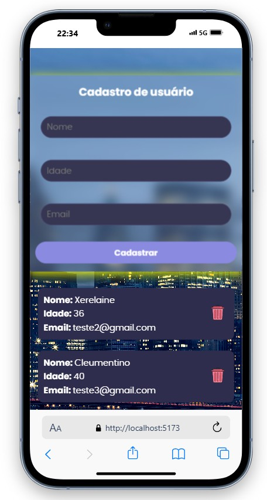
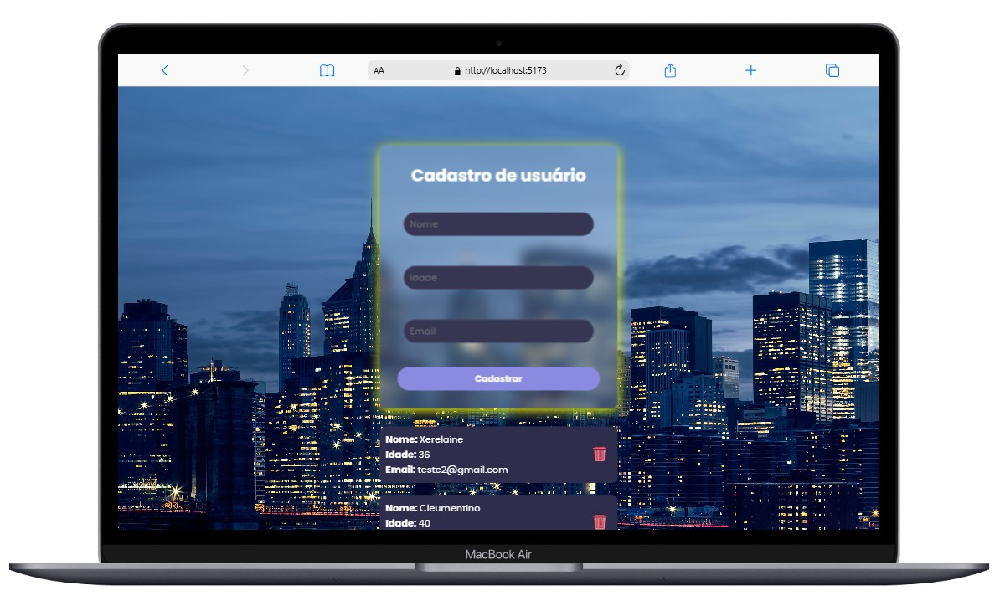

# PROJETO FULL STACK
## Projeto : Cadastro de Clientes 
### ( Parte 2 - FrontEnd )
 
### ⭕ Descrição 📝
 Essa segunda parte do projeto se consiste na interface da manipulaçao dos dados, o que é mostrado para o úsuario, seja cadastrando listando ou deletando usuários

## ⭕ Como usar 🚩
 Ao iniciar já vem mostrando os usuários ja criados,
 Ao digitar o nome, idade, e email, a clicar em cadastrar seja criado um usuário do banco de dados, e ao clicar na lixeira ao lado do nome o mesmo será deletado do banco de dados
 Quando for totalmente prenchido os campos será mostrado ao usuário uma menssagem de sucesso, assim como ao deletar
 Da mesma forma ao não prencher todos os campos e mesmo assim tentar criar cadastro sera mostrado umna messagem de erro
 Ao iniciar já vem mostrando os usuários ja criados,
 Ao digitar o nome, idade, e email, a clicar em cadastrar seja criado um usuário do banco de dados, e ao clicar na lixeira ao lado do nome o mesmo será deletado do banco de dados,

### ⭕ Tecnologias usadas 🖥️
   node.js -> execução JavaScript no servidor
   express -> facilita a criação de APIs e servidores web.
   prisma -> simplifica a interação com bancos de dados relacionais e NoSQL.
   API Rest -> usada comunicação com um backend ocorre por meio de requisições
   mongoDB -> Banco de dados NoSQL 
   axios -> Biblioteca JavaScript para fazer requisições HTTP

### ⭕ Dificuldades encontradas ⚒️
   ainda aprendendo conceitos novos e novas formas de manipulação do banco de dados

